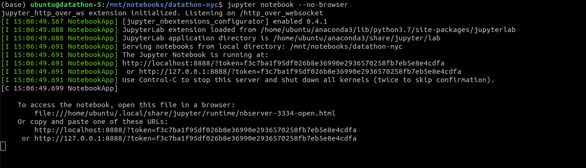
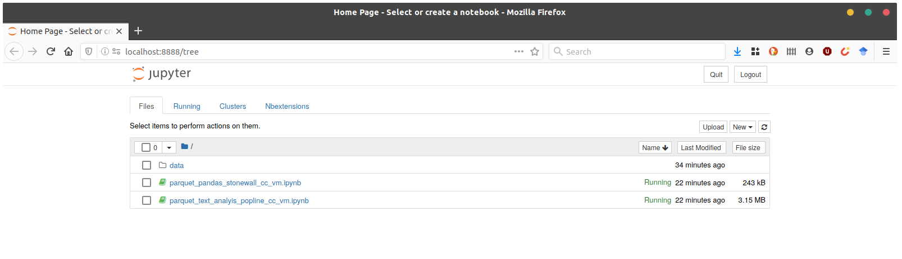

# Archives Unleashed NYC Datathon

We have a couple options for analysis platforms ([datasets are listed below](datathon-nyc#datasets)):

- If you'd like to keep things easy, and browser based, you're welcome to use [Google Colaboratory](https://colab.research.google.com). We have a couple options available in the repo ([parquet_pandas_example.ipynb](https://github.com/archivesunleashed/notebooks/blob/master/parquet_pandas_example.ipynb), [parquet_pandas_stonewall.ipynb](https://github.com/archivesunleashed/notebooks/blob/master/parquet_pandas_stonewall.ipynb), [parquet_pyspark_example.ipynb](https://github.com/archivesunleashed/notebooks/blob/master/parquet_pyspark_example.ipynb), [parquet_text_analyis.ipynb](https://github.com/archivesunleashed/notebooks/blob/master/parquet_text_analyis.ipynb), and [parquet_text_analyis_popline.ipynb](https://github.com/archivesunleashed/notebooks/blob/master/parquet_text_analyis_popline.ipynb)) that can be used as starting points. We recommend loading one up by clicking on the "Open in Colab" button on the top of a notebook, and saving a copy of whatever you do.
- If you're comfortable with the command line, you're welcome to use one of the virtual machines provided by [Compute Canada](https://www.computecanada.ca/home/). 

The virtual machines, and the machine backing a given Google Colab notebook are roughly similar. If you'd like to use a Compute Canada virtual machine, you'll have a bit more storage space, and you'll have a lot more control over things. You're welcome to install what you need to on the machines with `apt`.

## Virtual Machines

### c8-30gb-430gb

- 8 cores
- 30G RAM
- 11G `/`
- 398G `/mnt`
- Python 3.7.3 ([Anaconda](https://www.anaconda.com/distribution/))
  -  findspark, wordcloud, spacy, pyarrow, jupyter, tldextract, jupyter_contrib_nbextensions, pyspark
  -  feel free to `conda install` or `pip install` whatever else you need
- OpenJDK 8
- Spark 2.4.5
  - `SPARK_HOME=/home/ubuntu/spark`
- jq

Four machines available:

- 206.167.181.146 (datathon1)
- 206.167.182.14 (datathon2)
- 206.167.181.104 (datathon3)
- 206.167.181.105 (datathon4)

### c8-45gb-430gb

- 8 Cores
- 45G RAM
- 11G `/`
- 398G `/mnt`
- Python 3.7.3 ([Anaconda](https://www.anaconda.com/distribution/))
  - findspark, wordcloud, spacy, pyarrow, jupyter, tldextract, jupyter_contrib_nbextensions, pyspark
  - feel free to `conda install` or `pip install` whatever else you need
- OpenJDK 8
- Spark 2.4.5
  - `SPARK_HOME=/home/ubuntu/spark`
- jq

One machine available:

- 206.167.181.253 (datathon5)

## Getting Started

Please note, the datathon hosts (Ian, Jimmy, Nick, and Sam) all use macOS or Linux   variants. If you are on a Windows machine, things might be a little bit more difficult. If you have the [Windows SubSystem for Linux](https://www.howtogeek.com/249966/how-to-install-and-use-the-linux-bash-shell-on-windows-10/) installed, you should be in a really good place.

You may want to create a separate folder on your desktop or home directory to keep all of your datathon work in; this will also allow you to point terminal to one directory (folder).

### Shell into assigned VM

Ian or Nick will provide you with key to access a virtual machine via ssh. You'll need to download or copy that key to your own machine, and apply the appropriate permissions to it. The permissions on the key should be `600`. You can do this with the following command on your own laptop before shelling in:

  ```
  chmod 600 /path/to/archives-hackathon.key
  ```

Once you have the permissions set on the key, you can shell into your assigned datathon virtual machine with the provided key, and IP address:

Example:

```
ssh -L 8888:localhost:8888 -i ~/.ssh/archives-hackathon.key ubuntu@206.167.181.253
```

### Start Juypter Notebook

```
cd /mnt/notebooks/datathon-nyc
jupyter notebook --no-browser
```

Click on the the localhost link to open up Juypter.



Select one of the two example notebooks.



#### Inspiration

If you're looking for inspiration, check out the following notebook resources:

- [GLAM Workbench](https://glam-workbench.github.io/)
- [Awesome Jupyter GLAM](https://github.com/LibraryCarpentry/awesome-jupyter-glam)
- [Getting started with ODate](https://o-date.github.io/support/notebooks-toc/)
- [Jupyter notebooks for digital humanities](https://github.com/quinnanya/dh-jupyter)
- [Spark NLP Workshop](https://github.com/JohnSnowLabs/spark-nlp-workshop)
- [UW Interactive Data Lab, Data Visualization Curriculum](https://github.com/uwdata/visualization-curriculum)
- [Sentiment Analysis with Pyspark](https://github.com/tthustla/setiment_analysis_pyspark/blob/master/Sentiment%20Analysis%20with%20PySpark.ipynb)
- [Analysis of Car Accidents in Canada using PySpark](https://github.com/SinghGursimran/Analysis-of-Car-Accidents-in-Canada-using-PySpark/)

If you'd like to add your notebook to the repo at the end of the datathon, we'd love to have it!

### Start Spark with AUT

If you'd like to use Apache Spark and the Archives Unleashed Toolkit to analyze WARC/ARCs, you can get Spark started with the toolkit with the following command:

```
~/spark/bin/spark-shell --packages "io.archivesunleashed:aut:0.50.0"
```

Documentation for the 0.50.0 release is available [here](https://github.com/archivesunleashed/aut-docs/tree/master/aut-0.50.0), and if you need a refresher on the datathon homework, it is available [here](https://github.com/archivesunleashed/aut-docs/blob/master/aut-0.50.0/toolkit-walkthrough.md).

## Datasets

Scholarly derivatives created on cloud.archivesunleashed.org, and Parquet files should be downloaded to `/mnt/data`. If any team would like some WARC/ARC files from a collection, please work with Nick Ruest as soon as possible (`ruebot` in Slack).

**Ivy Plus Libraries Confederation**

- [National Statistical Offices and Central Banks Web Archive](https://zenodo.org/record/3633683)
- [Contemporary Composers Web Archive (CCWA)](https://zenodo.org/record/3692559)
- [#MeToo and the Women's Rights Movement in China Web Archive](https://zenodo.org/record/3633681)
- [Geologic Field Trip Guidebooks Web Archive](https://zenodo.org/record/3666295)
- [Literary Authors from Europe and Eurasia Web Archive](https://zenodo.org/record/3632728)
- [Web Archive of Independent News Sites on Turkish Affairs](https://zenodo.org/record/3633234)
- [State Elections Web Archive](https://zenodo.org/record/3635634)
- [Brazilian Presidential Transition (2018) Web Archive](https://zenodo.org/record/3659692)
- [Collaborative Architecture, Urbanism, and Sustainability Web Archive (CAUSEWAY)](https://zenodo.org/record/3674173)
- [Global Webcomics Web Archive](https://zenodo.org/record/3633737)
- [Queer Japan Web Archive](https://zenodo.org/record/3633284)
- [Extreme Right Movements in Europe](https://zenodo.org/record/3633161)
- [Latin American and Caribbean Contemporary Art Web Archive](https://zenodo.org/record/3633118)
- [Popline and K4Health Web Archive](https://zenodo.org/record/3633022)
- [Eastern Europe and Former Soviet Union Web Archive](https://zenodo.org/record/3633031)
- [Independent Documentary Filmmakers from China, Hong Kong, and Taiwan Web Archive](https://zenodo.org/record/3632912)

**Columbia University Libraries**

- [General](https://zenodo.org/record/3633290)
- [Resistance](https://zenodo.org/record/3660457)
- [Stonewall 50 Commemoration](https://zenodo.org/record/3631347)
- [Freely Accessible eJournals](https://zenodo.org/record/3633671)
- [Avery Library Historic Preservation and Urban Planning](https://doi.org/10.5683/SP2/Z68EVJ)
- [Rare Book and Manuscript Library](https://zenodo.org/record/3701593)
- [Burke Library New York City Religions](https://zenodo.org/record/3701455)
